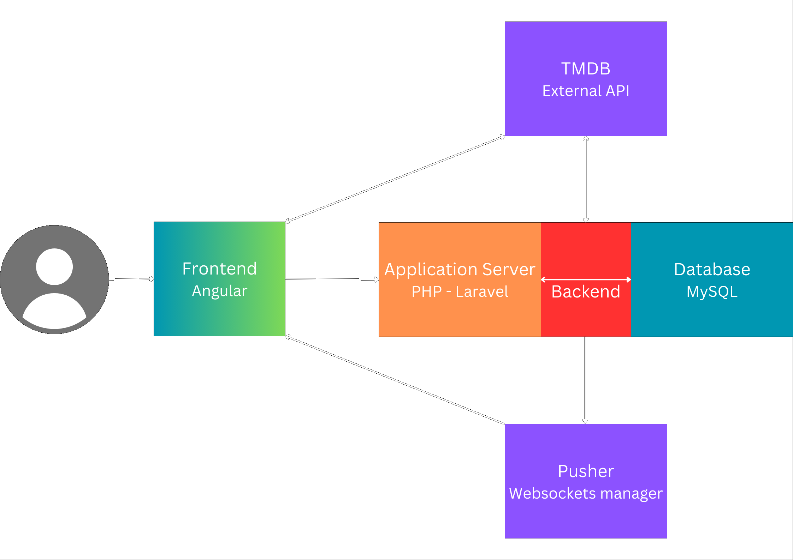

## Description 
IMDb (an initialism for Internet Movie Database) is an online database of information related to films, television series, podcasts, home videos, video games, and streaming content online – including personal biographies, plot summaries, ratings, and fan and critical reviews.
## Key Features

- **Movie Search**: Quickly search for movies by title or category.
- **Movie Discovery**: Explore new movies based on popular genres, ratings, and recommendations.
- **Reviews**: Leave reviews for movies you’ve watched and see what other users think.
- **Movie Ratings**: Rate movies using a 1 to 10-star system.
- **Categories**: Movies are organized into categories such as action, comedy, drama, horror, science fiction, and more.
- **User-Friendly Interface**: An easy-to-use design for a pleasant experience on all devices.
- **See Other User Reviews**: Check out what other users have said about movies with their detailed reviews and ratings.

## Technologies Used

- **Frontend**: Angular
- **Backend**: Laravel (PHP)
- **Database**: MySQL
- **Authentication**: Laravel Sanctum
- **Movie API**: [The Movie Database (TMDb)](https://www.themoviedb.org/documentation/api)
- **WebSockets**: [Pusher](https://pusher.com/)
- **Testing**:
  - Unit Testing: PHPUnit
  - Integration Testing: PHPUnit
  - End-to-end Testing: Playwright
  - Performance Testing: k6


### Prerequisites

- PHP
- Composer
- XAMPP
- ZIP Extension for XAMPP (activated from php.ini)
- Node.js
- Angular CLI
- MySQL

### Backend Setup
```bash
git clone https://github.com/7uddy/IMDB.git
cd IMDB
cd backend
composer install
```
### Configure the .env file
```bash
DB_CONNECTION=mysql
DB_HOST=127.0.0.1
DB_PORT=3306
DB_DATABASE=imdb
DB_USERNAME=root
DB_PASSWORD=

TMDB_API_KEY=your_tmdb_api_key
BROADCAST_CONNECTION=pusher
BROADCAST_DRIVER=pusher
PUSHER_APP_ID=your_id
PUSHER_APP_KEY=your_key
PUSHER_APP_SECRET=your_secret
PUSHER_APP_CLUSTER=your_cluster
```

### Run migrations
```bash
php artisan migrate
```
### Start the Laravel server
```bash
php artisan serve
```

### Frontend Setup
```bash
cd frontend
npm install
ng serve
```
## System Architectural Diagram


## Photos with Desktop layout

|            |          |
|----------------------|----------------------|
|  |  |
|  |  |
|  |  |
|  |  |
 

## Photos with Mobile layout

|            |          |
|----------------------|----------------------|
|  |  | 
|  |  |
| |  | 
| |


